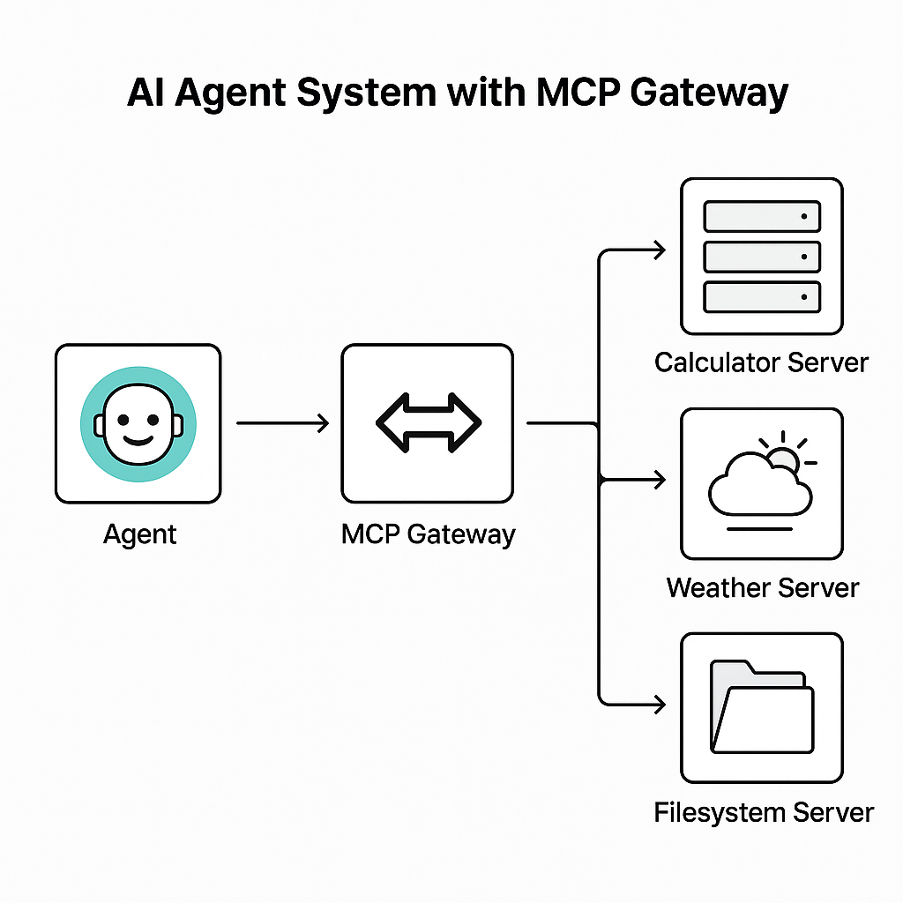

# Model-Context-Protocol

MCP is an open protocol that standardizes how applications provide context to LLMs. Think of MCP like a USB-C port for AI applications. Just as USB-C provides a standardized way to connect your devices to various peripherals and accessories, MCP provides a standardized way to connect AI models to different data sources and tools.

---

# AI Agent System with MCP Gateway



---

## Prerequisite
- Python `3.10` or higher installed.

- You must use the Python MCP SDK `1.2.0` or higher.
  
- Install [`uv`](https://docs.astral.sh/uv/) package manager (***Optional***)

---

## Quickstart

#### Clone the repository

    ```bash
    $ git clone <clone-url>
    ```

#### Run the MCP servers
   
   ```bash
   $ cd mcp-servers/<perticular-server-folder>

   $ python3 -m venv .venv
   
   $ source .venv/bin/activate # For Windows: .venv\Scripts\activate
   
   $ pip install -r requirements.txt # or uv sync

   $ python <python-file>.py
   ```

#### Run MCP Client to test the MCP server (***Optional***)
   
1. Setup
  
```bash
$ cd mcp-clients/simple-cient

$ python3 -m venv .venv

$ source .venv/bin/activate # For Windows: .venv\Scripts\activate

$ pip install -r requirements.txt # or uv sync
```

2. Replace the MCP Server endpoint as `url` value in the `client.py`.
    

3. Run the Client (Currently, only listing the tools.)

```bash
$ python client.py
```

#### Run the MCP gateway
   
```bash
$ cd mcp-gateway

$ python3 -m venv .venv

$ source .venv/bin/activate # For Windows: .venv\Scripts\activate

$ pip install -r requirements.txt

$ python gateway.py
```

#### Run the MCP Agent

1. Go to the MCP agent directory.
   
```bash
$ cd mcp-agent
```

2. Create a `.env` file

```bash
LLM_PROVIDER=gemini
GOOGLE_API_KEY=<gemini-api-key>
```

3. Create virtual environment and install dependencies.

```bash
$ python3 -m venv .venv

$ source .venv/bin/activate # For Windows: .venv\Scripts\activate

$ pip install -r requirements.txt
```
   
4. Run the agent.

``` bash
$ python main.py
```

#### Ask queries in the agent and find the result
   
#### Play around with the servers and agents.

---
   
### Add New MCP Servers
If you want to add new MCP Servers to the gateway. Add it's endpoint to `SERVER_REGISTRY` dictonary in `gateway.py`.

---


## MCP Servers

MCP servers the repository contains are created using FastMCP package from MCP Python SDK.

- It uses `Streamable HTTP` transport.
- Its `stateless`.


## MCP Gateway

An **MCP Gateway** is a crucial piece of infrastructure that sits between MCP clients (***agents***) and a multitude of MCP servers (***tools***). It acts as a centralized control plane, offering:

1. **Unified Access:** A single entry point to a wide range of tools.
   
2. **Security:** Centralized authentication, authorization, and secrets management.

3. **Observability:** Monitoring, logging, and tracing of all tool interactions.
   
4. **Management:** A central place to register, discover, and manage available tools.

## Agent

Supported LLM provider